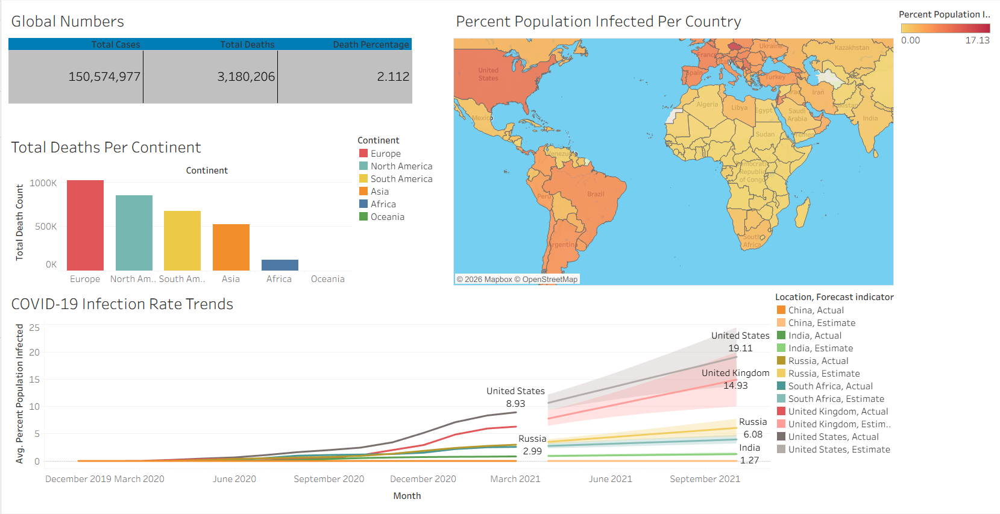

# COVID-19 Analytics Dashboard

Built an end-to-end COVID-19 analytics solution using SQL Server and Tableau, analyzing over 150 million global cases and visualizing infection, mortality, and vaccination trends through an interactive dashboard.

## Overview

This project presents an end-to-end COVID-19 data analysis and visualization solution built using SQL Server and Tableau. The objective was to analyze global pandemic trends, identify infection and mortality patterns, evaluate vaccination progress, and communicate insights through an interactive dashboard.

The project combines data exploration, SQL-based analysis, and business intelligence visualization to transform raw COVID-19 data into actionable insights.

---

## Project Objectives

* Analyze global COVID-19 cases and deaths.
* Compare mortality rates across continents.
* Identify countries with the highest infection rates relative to population.
* Track vaccination progress over time.
* Build an interactive dashboard for data-driven decision making.

---

## Tools & Technologies

* SQL Server
* Tableau Public
* Microsoft Excel (Data Source)

---
## Data Source

The project uses publicly available COVID-19 datasets containing global case, death, population, and vaccination statistics.

Datasets:
- CovidDeaths.xlsx
- CovidVaccinations.xlsx

---
## SQL Concepts Demonstrated

* Data Cleaning
* Aggregate Functions
* Joins
* Common Table Expressions (CTEs)
* Temporary Tables
* Views
* Window Functions
* Rolling Calculations
* Data Exploration & Analysis

---

## Dashboard Features

### Global KPIs

* Total Cases
* Total Deaths
* Global Death Percentage

### Geographic Analysis

* Interactive world map showing infection rates by country.
* Country-level comparison of COVID-19 spread.

### Continent-Level Analysis

* Total deaths by continent.
* Comparative visualization of pandemic impact.

### Trend Analysis

* Infection rate trends over time.
* Forecast visualization for selected countries.

---

## Dashboard Preview

---

## Live Dashboard

View the interactive dashboard on Tableau Public:

https://public.tableau.com/app/profile/vaibhav.khandelwal6292/viz/COVID-19GlobalAnalyticsDashboard_17803247062530/Dashboard1

---

## Key Insights

* Europe recorded the highest total death count among all continents.
* Significant variation exists in infection rates across countries.
* Vaccination progress differed substantially between regions.
* Trend analysis highlights the evolution of infection rates over time.

---

## Skills Demonstrated

* SQL Query Writing
* Data Analysis
* Business Intelligence
* Data Visualization
* Dashboard Design
* Analytical Thinking
* Data Storytelling

---

## Author

**Vaibhav Khandelwal**

B.Tech Computer Science Engineering  
Jaypee Institute of Information Technology, Noida

Tableau Public:
https://public.tableau.com/app/profile/vaibhav.khandelwal6292/vizzes
